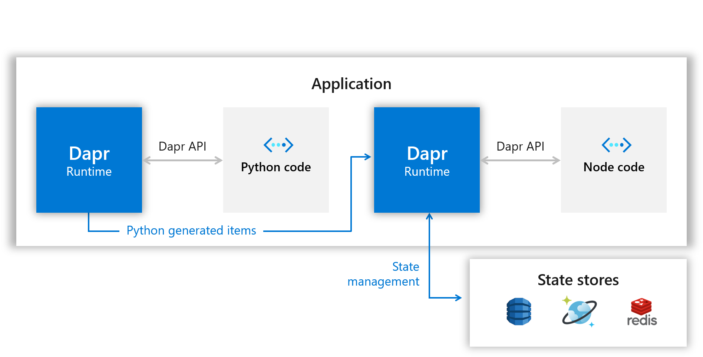
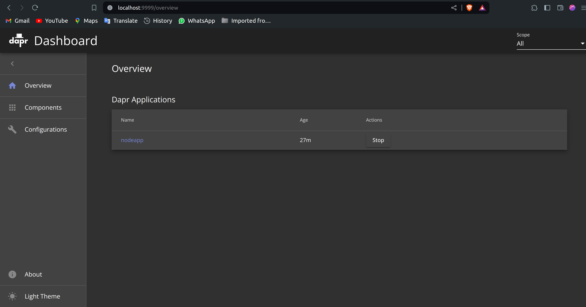
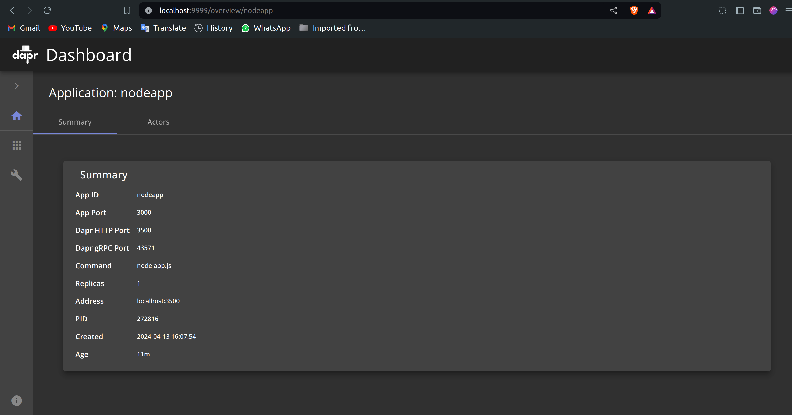
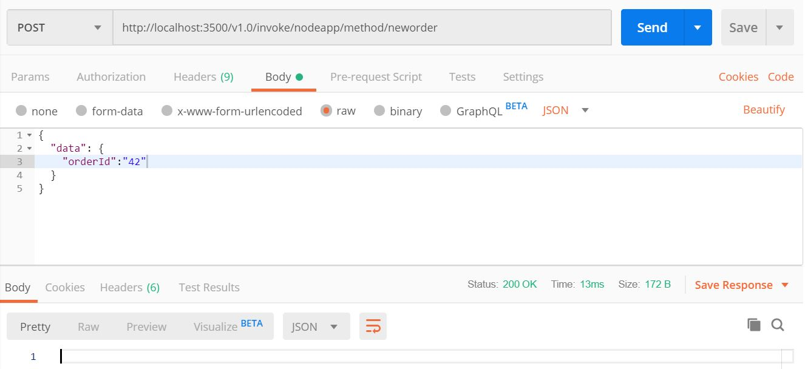
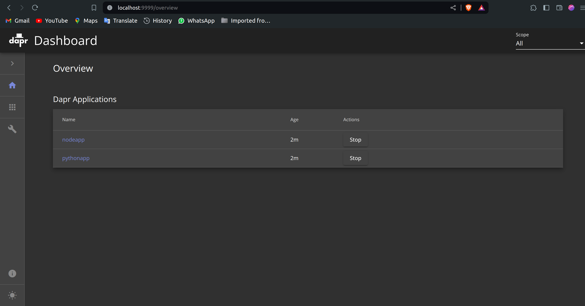
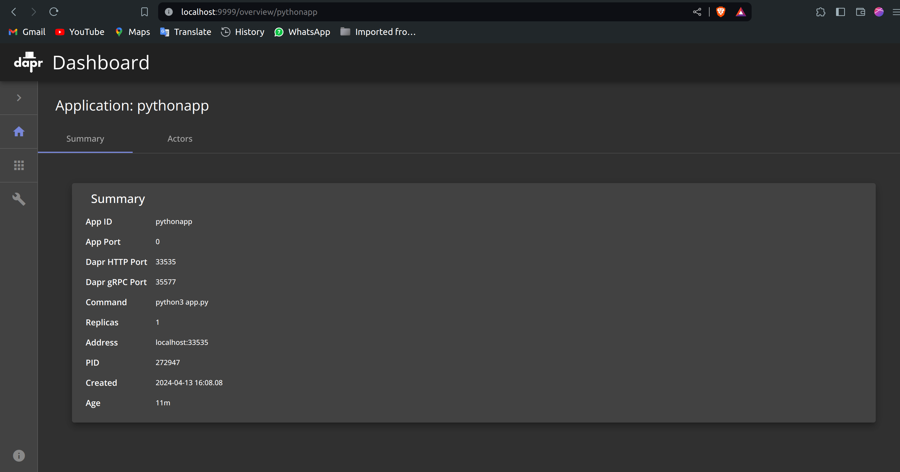

# [Hello World](https://github.com/dapr/quickstarts/tree/master/tutorials/hello-world)

This tutorial will demonstrate how to get Dapr running locally on your machine. You'll be deploying a Node.js app that subscribes to order messages and persists them. The following architecture diagram illustrates the components that make up the first part sample:


Later on, you'll deploy a Python app to act as the publisher. The architecture diagram below shows the addition of the new component:



## Prerequisites
This quickstart requires you to have the following installed on your machine:
- [Docker](https://docs.docker.com/)
- [Node.js version 14 or greater](https://nodejs.org/en/)
- [Python 3.x](https://www.python.org/downloads/): Note: When running this quickstart on Windows, it best to install Python from python.org rather than from the Windows store.
- [Postman](https://www.getpostman.com/) [Optional]

## Step 1 - Setup Dapr

Follow [instructions](https://docs.dapr.io/getting-started/install-dapr-cli/) to download and install the Dapr CLI and initialize Dapr.

## Step 2 - Setup locally Helloword with DAPR

Now that Dapr is set up locally, clone the repo, then navigate to the Node.js version of the Hello World:

```sh
git clone https://github.com/EmpowerInnovate/DAPR-Locally-HelloWord
cd hello-world/node
```

Dapr CLI creates an environment variable for the Dapr port, which defaults to 3500. You'll be using this in step 3 when sending POST messages to the system. 


## Step 3 - Run the Node.js app with Dapr

Open a new terminal and navigate to the `./hello-world/node` directory and follow the steps below:

1. Install dependencies:

   ```bash
   npm install
   ```

<!-- END_STEP -->

This will install `express` and `body-parser`, dependencies that are shown in the `package.json`.

<!-- STEP
expected_stdout_lines:
  - "You're up and running! Both Dapr and your app logs will appear here."
  - "== APP == Got a new order! Order ID: 42"
  - "== APP == Successfully persisted state."
  - "== APP == Got a new order! Order ID: 42"
  - "== APP == Successfully persisted state."
  - "== APP == Got a new order! Order ID: 1"
  - "== APP == Successfully persisted state."
  - "== APP == Got a new order! Order ID: 2"
  - "== APP == Successfully persisted state."
  - "== APP == Got a new order! Order ID: 3"
  - "== APP == Successfully persisted state."
  - "== APP == Got a new order! Order ID: 4"
  - "== APP == Successfully persisted state."
  - "== APP == Got a new order! Order ID: 5"
  - "== APP == Successfully persisted state."
  - "Exited Dapr successfully"
  - "Exited App successfully"
expected_ STEP
expected_stdout_lines:
expected_stderr_lines:
name: "npm install"
working_dir: node
-->tderr_lines:
output_match_mode: substring
name: "run npm app"
background: true
working_dir: node
sleep: 5
-->

2. Run Node.js app with Dapr:
   ```bash
   dapr  -run-app-id nodeapp --app-port 3000 --dapr-http-port 3500 node app.js
   ```

<!-- END_STEP -->


You can see the yaml file defined the state store to be Redis and is naming it `statestore`. This is the name which was used in `app.js` to make the call to the state store in the application:


While in this tutorial the default yaml files were used, usually a developer would modify them or create custom yaml definitions depending on the application and scenario.

> **Optional**: Now it would be a good time to get acquainted with the [Dapr dashboard](https://docs.dapr.io/reference/cli/dapr-dashboard/). Which is a convenient interface to check status and information of applications running on Dapr. The following command will make it available on http://localhost:9999/.

```bash
dapr dashboard -p 9999
```






## Step 4 - Post messages to the service

Now that Dapr and the Node.js app are running, you can send POST messages against it, using different tools. **Note**: here the POST message is sent to port 3500 - if you used a different port, be sure to update your URL accordingly.

First, POST the message by using Dapr cli in a new terminal:

<!-- STEP
expected_stdout_lines:
  - "App invoked successfully"
expected_stderr_lines:
output_match_mode: substring
name: dapr invoke
working_dir: node
-->

```bash
dapr invoke --app-id nodeapp --method neworder --data-file sample.json
```

<!-- END_STEP -->

```bash
curl -XPOST -d @sample.json -H Content-Type:application/json http://localhost:3500/v1.0/invoke/nodeapp/method/neworder
```

<!-- END_STEP -->

Last but not least, you can use the Postman GUI.

Open Postman and create a POST request against `http://localhost:3500/v1.0/invoke/nodeapp/method/neworder`

In your terminal, you should see logs indicating that the message was received and state was updated:
```bash
== APP == Got a new order! Order ID: 42
== APP == Successfully persisted state.
```

## Step 5 - Confirm successful persistence

Now, to verify the order was successfully persisted to the state store, create a GET request against: `http://localhost:3500/v1.0/invoke/nodeapp/method/order`. **Note**: Again, be sure to reflect the right port if you chose a port other than 3500.

<!-- STEP
expected_stdout_lines:
  - '{"orderId":"42"}'
expected_stderr_lines:
name: Persistence test curl
-->

```bash
curl http://localhost:3500/v1.0/invoke/nodeapp/method/order
```

<!-- END_STEP -->

or use Dapr CLI

<!-- STEP
expected_stdout_lines:
  - '{"orderId":"42"}'
  - "App invoked successfully"
expected_stderr_lines:
output_match_mode: substring
name: Persistence test dapr invoke
-->

```bash
dapr invoke --app-id nodeapp --method order --verb GET
```

<!-- END_STEP -->

or use the Postman GUI


This invokes the `/order` route, which calls out to the Redis store for the latest data. Observe the expected result!

## Step 6 - Run the Python app with Dapr

Take a look at the Python App in the `./hello-world/python` directory to see how another application can invoke the Node App via Dapr without being aware of the destination's hostname or port. In the `app.py` file you can find the endpoint definition to call the Node App via Dapr.

```python
dapr_port = os.getenv("DAPR_HTTP_PORT", 3500)
dapr_url = "http://localhost:{}/v1.0/invoke/nodeapp/method/neworder".format(dapr_port)
```
It is important to notice the Node App's name (`nodeapp`) in the URL, it will allow Dapr to redirect the request to the right API endpoint. This name needs to match the name used to run the Node App earlier in this exercise.

The code block below shows how the Python App will incrementally post a new orderId every second, or print an exception if the post call fails.

```python
n = 0
while True:
    n += 1
    message = {"data": {"orderId": n}}

    try:
        response = requests.post(dapr_url, json=message)
    except Exception as e:
        print(e)

    time.sleep(1)
```

Now open a **new** terminal and go to the `./hello-world/python` directory.

<!-- STEP
name: "Install python requirements"
-->

1. Install dependencies:

   ```bash
   pip3 install requests
   ```

<!-- END_STEP -->

<!-- STEP
expected_stdout_lines:
  - "You're up and running! Both Dapr and your app logs will appear here."
  - "Exited Dapr successfully"
  - "Exited App successfully"
expected_stderr_lines:
output_match_mode: substring
name: "run python app"
background: true
working_dir: python
sleep: 30
-->

2. Start the Python App with Dapr:

   ```bash
   dapr run --app-id pythonapp python3 app.py
   ```





<!-- END_STEP -->

3. If all went well, the **other** terminal, running the Node App, should log entries like these:

    ```
    Got a new order! Order ID: 1
    Successfully persisted state
    Got a new order! Order ID: 2
    Successfully persisted state
    Got a new order! Order ID: 3
    Successfully persisted state
    ```

> **Known Issue**: If you are running python3 on Windows from the Microsoft Store, and you get the following error message:

    exec: "python3": executable file not found in %!P(MISSING)ATH%!(NOVERB)

> This is due to golang being unable to properly execute Microsoft Store aliases. You can use the following command instead of the above:

    dapr run --app-id pythonapp cmd /c "python3 app.py"

4. Now, perform a GET request a few times and see how the orderId changes every second (enter it into the web browser, use Postman, or curl):

    ```http
    GET http://localhost:3500/v1.0/invoke/nodeapp/method/order
    ```
    ```json
    {
        "orderId": 3
    }
    ```

> **Note**: It is not required to run `dapr init` in the **second** terminal because dapr was already setup on your local machine initially, running this command again would fail.

## Step 7 - Cleanup

To stop your services from running, simply stop the "dapr run" process. Alternatively, you can spin down each of your services with the Dapr CLI "stop" command. For example, to spin down both services, run these commands in a new terminal:

<!-- STEP
expected_stdout_lines:
  - 'app stopped successfully: nodeapp'
  - 'app stopped successfully: pythonapp'
expected_stderr_lines:
output_match_mode: substring
name: Shutdown dapr
-->

```bash
dapr stop --app-id nodeapp
```

```bash
dapr stop --app-id pythonapp
```

<!-- END_STEP -->

To see that services have stopped running, run `dapr list`, noting that your services no longer appears!

## Next steps

Now that you've gotten Dapr running locally on your machine, consider these next steps:
- Explore additional quickstarts such as [pub-sub](../pub-sub), [bindings](../bindings) or the [distributed calculator app](../distributed-calculator).
- Run this hello world application in Kubernetes via the [Hello Kubernetes](../hello-kubernetes) quickstart.
- Learn more about Dapr in the [Dapr overview](https://docs.dapr.io/concepts/overview/) documentation.
- Explore [Dapr concepts](https://docs.dapr.io/concepts/) such as building blocks and components in the Dapr documentation.
